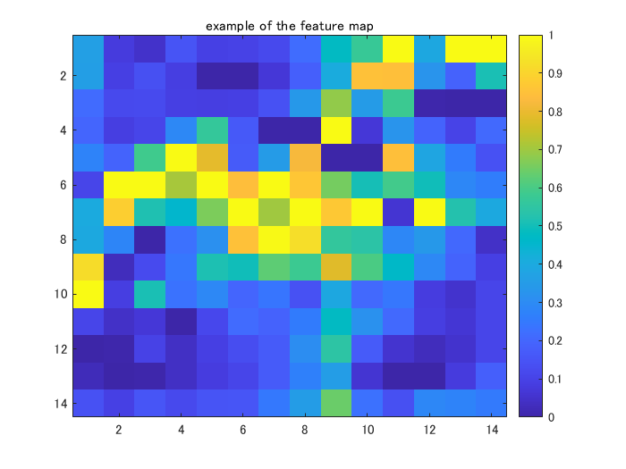

# Explainable AI: interpreting the classification using score-CAM

This example shows how to use score-CAM (class activation mapping) [1] to investigate and explain the predictions of a deep convolutional neural network for image classification. This code was created with reference to Matlab official document [2]. 

[1] Wang, H., Du, M., Yang, F. and Zhang, Z., 2019. Score-CAM: Improved Visual Explanations Via Score-Weighted Class Activation Mapping. *arXiv preprint arXiv:1910.01279*.

[2] MATLAB documentation: "[Investigate Network Predictions Using Class Activation Mapping](https://jp.mathworks.com/help/deeplearning/ug/investigate-network-predictions-using-class-activation-mapping.html)"  

[3] Zhou, B., Khosla, A., Lapedriza, A., Oliva, A. and Torralba, A., 2016. Learning deep features for discriminative localization. In *Proceedings of the IEEE conference on computer vision and pattern recognition* (pp. 2921-2929).  

**The official implementation of Score-CAM is located [here](https://github.com/haofanwang/Score-CAM).**


# Load Pretrained Network 

Load a pretrained convolutional neural network for image classification. Please select the pretrained network from the pull-down. In this code, the network such as SqueezeNet, GoogLeNet, ResNet-18, and MobileNet-v2 are avalable. While we cannot perform class activation mapping with networks that have multiple fully connected layers at the end of the network, such as AlexNet, VGG-16, and VGG-19, score-CAM can visualize the region where is influencial to the prediction .

```matlab:Code
clear;clc;close all
netName = "squeezenet";
net = eval(netName);
```

# Extract the image input size and the output classes of the network

 The `activationLayerName` helper function, defined at the end of this example, returns the name of the layer to extract the activations from. This layer is the ReLU layer that follows the last convolutional layer of the network.

```matlab:Code
inputSize = net.Layers(1).InputSize(1:2);
classes = net.Layers(end).Classes;
layerName = activationLayerName(netName);
```

# Read your target image and resize so as to feed into the CNN network

Compute the activations of the resized image in the ReLU layer that follows the last convolutional layer of the network.

```matlab:Code
im = imread('CatImg.png');
imResized = imresize(im,[inputSize(1:2)]);
```

# Classify the target image into a category 

```matlab:Code
[PredCategory,~]=classify(net,imResized);
PredCategory
```

```text:Output
PredCategory = 
     Norwegian elkhound 

```

Extract the index of the predicted class for the following process

```matlab:Code
classIdx=find((net.Layers(end, 1).Classes==PredCategory)==1);
```

# Calculate feature map using `activation` function

 Display the feature maps after performing convolution to the final convolutional layer

```matlab:Code
featureMap = activations(net,imResized,layerName);
MapDim=size(featureMap,3);
idx=randi(MapDim,[1 1]);
figure;imagesc(normalize(featureMap(:,:,idx),'range'));title('example of the feature map');colorbar
```



# Obtain dot-product of input image and resized feature map

This section includes

   1.  normalize the feature maps into [0 1] 
   1.  convert the feature map into the map with three-channel (grayscale to RGB imge).  
   1.  Obtain dot-product of the input image and the feature map in the last step 

```matlab:Code
featureMap_normalized=zeros([inputSize,MapDim]);
for i=1:size(featureMap,3)
    featureMap_resized(:,:,i)=imresize(featureMap(:,:,i),inputSize,'Method',"bilinear");    
    featureMap_normalized(:,:,i) = normalize(featureMap_resized(:,:,i),'range');
    featureMap_layered_i=cat(3,featureMap_normalized(:,:,i),featureMap_normalized(:,:,i),featureMap_normalized(:,:,i)); 
    maskedInputImg(:,:,:,i)=featureMap_layered_i.*double(imResized);
end
```

Display the example 

```matlab:Code
figure;idx=randi(MapDim,[12 1]);
exImg=maskedInputImg(:,:,:,idx);
montage(uint8(exImg));title('example of masked images for input')
```


# Inference with the masked images

Use `classify` function to predict and extract the score for the target class

```matlab:Code
% specify minibatch size. Return an error if the memory is not enough   
[PredCategory,score]=classify(net,uint8(maskedInputImg),'MiniBatchSize',32);
score_target_class=score(:,classIdx);
```

# Multiply the featuremap with the score with corresponding input mask image 

Generate course heat map for your final result. The size of the course map is identical to the size of the feature map.  

```matlab:Code
score_CAM_prep=featureMap_normalized.*reshape(score_target_class,[1 1 numel(score_target_class)]);
score_CAM_sum=sum(score_CAM_prep,3);
```

Operate ReLu function where the element less than 0 is converted into 0. Only the region which is positively influencial to the class of interest is extracted for the linear map combination.   

```matlab:Code
score_CAM_sum(score_CAM_sum<0)=0;
```

Normalize the feature map into [0 1]. Just writing 'range' is fine for the [0 1] normalization.  

```matlab:Code
score_CAM_scaled=normalize(score_CAM_sum,'range');
```

Visualization setup

```matlab:Code
cmap = jet(255).*linspace(0,1,255)';
score_CAM = ind2rgb(uint8(score_CAM_scaled*255),cmap)*255;
```

Combine the grayscaled input image with the heat map

```matlab:Code
combinedImage = double(rgb2gray(imResized))/2 + score_CAM;
```

Normalize into [0 255] for image output

```matlab:Code
combinedImage = normalizeImage(combinedImage)*255;
```

Display the score-cam result

```matlab:Code
figure;imshow(uint8(combinedImage));colorbar;colormap('jet')
```


# Helper Functions

```matlab:Code
function N = normalizeImage(I)
minimum = min(I(:));
maximum = max(I(:));
N = (I-minimum)/(maximum-minimum);
end
```

# Get the name of the last convolutional layer

Input: the pretrained network name 

Output: the name of the last convolutional layer

```matlab:Code
function layerName = activationLayerName(netName)

if netName == "squeezenet"
    layerName = 'conv10';
elseif netName == "googlenet"
    layerName = 'inception_5b-output';
elseif netName == "resnet18"
    layerName = 'res5b';
elseif netName == "mobilenetv2"
    layerName = 'Conv_1';
elseif netName == "vgg16"
    layerName = 'conv5_3';
elseif netName == "alexnet"
    layerName = 'conv5';
end

end
```
