# 説明可能なAI：Score-CAMによる判断根拠の可視化

この記事は、[MATLAB](http://d.hatena.ne.jp/keyword/MATLAB)/[Simulink](http://d.hatena.ne.jp/keyword/Simulink) Advent Calendar 2021（カレンダー2）の16日目の記事として書かれています。

[https://qiita.com/advent-calendar/2021/matlab](https://qiita.com/advent-calendar/2021/matlab)

# はじめに

この記事では、深層学習（ここでは、畳み込み込みニューラルネットワーク）で画像分類を行ったときの、判断根拠の可視化に関して扱います。CAMやgrad-cam, LIMEなどが有名ですが、今回はScore-CAMと呼ばれる手法について勉強したのでここにまとめたいと思います。また、勉強のために、私自身で実装も行いました。

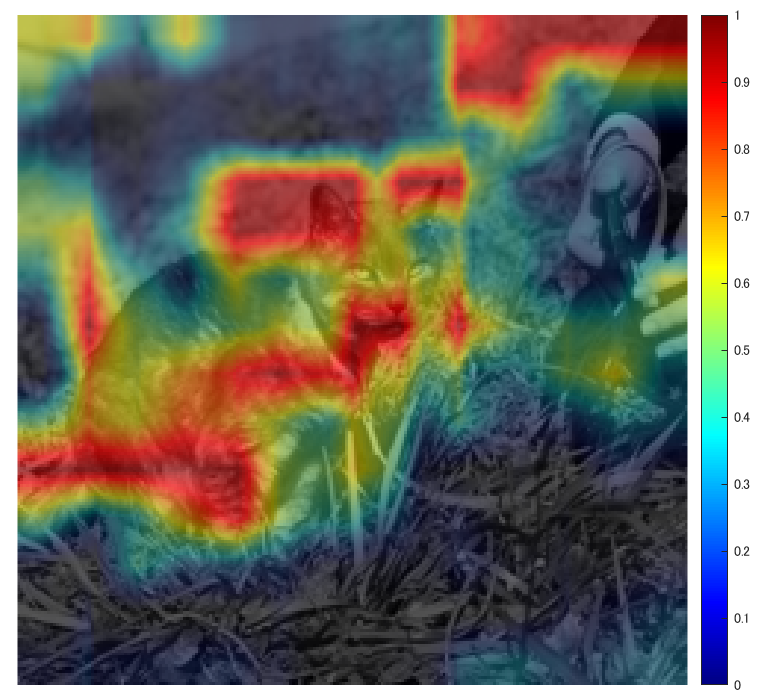

LIMEに関しては、私の別の記事で扱っており、こちらも見ていただけますと幸いです。

[https://kentapt.hatenablog.com/entry/2021/12/06/224424](https://kentapt.hatenablog.com/entry/2021/12/06/224424)

実装のためのコードやデータはこちらにアップロードしてあります

https://github.com/KentaItakura/Explainable-AI-interpreting-the-classification-using-score-CAM

深層学習の結果に対する「なぜ？」を扱う、説明可能AIについては、例えば以下の記事がわかりやすかったです。

[https://xtech.nikkei.com/atcl/nxt/column/18/01147/122200003/](https://xtech.nikkei.com/atcl/nxt/column/18/01147/122200003/)

# イントロダクションの和訳

深層学習を用いた画像分類の判断根拠の可視化の方法はいくつか有名なものがあり、本手法との比較などについて気になりました。そこで、以下に、**私の勝手な解釈に基づいた**論文のイントロダクションの和訳を掲載します。意訳なども含むのでご注意ください。

========================================================

## イントロの中での序論

ディープニューラルネットワーク(DNN)の判断根拠の説明により、人間がそのモデルを解釈する上で重要な、推論におけるいくつかの側面を明らかにすることができる。また、それにより、その推論結果の透明性（や信頼性）を高めることができる。説明の中でも、入力の中で重要な領域や量、または学習された重みを可視化することは、説明性を加えることにおいて、最もわかりやすい方法である。空間畳み込みは、画像処理や言語処理における最先端のモデルを構築するために頻繁に使用される要素技術である。そのため、畳み込み込みニューラルネットワークをよりよく説明するために、多くの研究が行われてきており、勾配の可視化 [15]、摂動（Perturbation：筆者追記ここでは、以前の投稿で紹介したLIMEのこと）[10]、クラス活性化マップ(CAM) [21]の3つが広く用いられてきた。

## ３つの代表的な方法の概要とその問題点

　勾配に基づく方法では、対象のクラスに関わる勾配を逆誤差伝搬し、その推論に影響している画像中の領域をハイライトするものである。（つまり、そこで得られる）Saliency Map （顕著性マップ）[15] は、入力画像に対するターゲットクラスのスコアの微分をを行い、その推論結果を説明している。その他の先行研究[1, 8, 17, 18, 20]では、その勾配情報にさらに操作を加えることで、結果を視覚的に鮮明にする。しかし、これらのマップは一般的に低品質でノイズを多く含む[8]という問題がある。

　摂動に基づくアプローチ[3, 5, 6, 9, 10, 19]は、入力画像に摂動を与え、その摂動を与えた画像に対する、予測値の変化を観察する。しかし、最小領域を見つけるために、これらのアプローチは通常は正則化[6]を追加する必要があり、さらに、計算量が多いというデメリットがある。

　CAM (Class Activation Mapping) ベースの説明 [4, 12, 21] も同様に、視覚的な判断根拠の説明を得ることのできる方法である。そこでは、単一の入力画像に対して行い、推論時の活性化マップと、そのマップにそれぞれ係数を与え足し合わせたもので組み合わせで判断根拠の説明のためのヒートマップ作成した。しかし、その手法は、適用可能なCNNの構造に制限があり、グローバルプーリング層 [7] が必要である。

## 提案手法の必要性

　Grad-CAM [12]や、そこから派生したもの、例えばGrad-CAM++ [4]などでは、グローバルプーリング層を持たないモデルにもCAMが適用できるように一般化した。これらの研究では、勾配情報の使用を再検討したが、それと同時に、GradCAMは、CAMをさらに一般化するためには、勾配の利用は必ずしも理想的ではない、ということにも言及している。本研究では、勾配の情報をもとに行うアプローチであるCAMの制約に言及し、それに対処するために、新たな判断根拠の可視化手法である、Score-CAMを提案する。Score-CAMでは、局所的な感度測定（＝勾配を用いた方法）の代わりに、学習済みのCNNにて特定の画像を推論した時の活性化マップを用いる。その活性化マップにしたがって生成した（微調整した）画像をそのCNNに入力して得たときの結果をもとに、その分類の重要度を可視化する。

## Score-CAMのアピールポイント

　本研究での、我々の貢献は以下の通りである。

(1) 勾配を用いない、新しい判断根拠の可視化手法を提案する。ここでは、摂動に基づく方法（LIMEなど）とCAMに基づく方法のギャップを埋め（両方のいいところどりをし、という意味に近い？）、そして、活性化マップや重み付けを用いた直感的に理解しやすい方法を開発した。

(2) Average Drop / Average Increase and Deletion curve / Insertion curveなどの指標にて本手法を定量的に評価した。そして、Score-CAMがより良い結果を有することを確認した。

(3) 可視化および判断根拠の位置の正しさを定性的に評価し、両タスクで良好な結果を得ることができた。最後に、CNNモデル自体の解析のためのツールとしてのScore-CAMの有効性を述べる。

========================================================

以上が、Score-CAMの論文のイントロダクションの和訳になります。CAMは、グローバルプーリング層が最後のほうにないとできないので、使えるモデルが限られてしまったり、その構造を再度追加して、再学習などが必要になりますね。ここでは、「摂動を加える」と表現されている、例えば上の記事で紹介したようなLIMEでは、多くの（例：1000以上）の画像のパターンを作ってそれらの推論結果を使って判断根拠の可視化結果（ヒートマップ）を作る必要があるので、計算時間において課題はありそうです。grad-camも、smooth-gradなどの方法もあるものの、そもそも勾配を直接的に使わない方法はないか？と考えている、という流れだったと理解しました。

# Score-CAMの大まかな流れ

1. テストしたい画像と、学習済みのCNNを用意し、その画像を推論する

下の図はAlexNetを例にCNNの構造を`deepNetworkDesigner`で可視化しています。

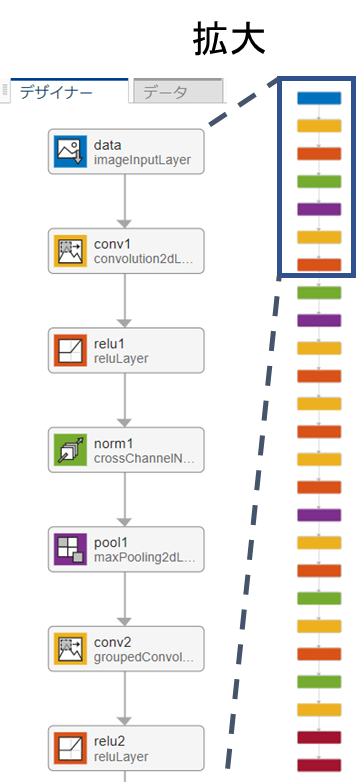

2.  1のようにCNNを用意して推論をしていくと、それぞれの層で演算していくと、畳み込み込み演算やプーリングによって、空間的な（XY方向の）サイズが小さくなっていくことがわかります

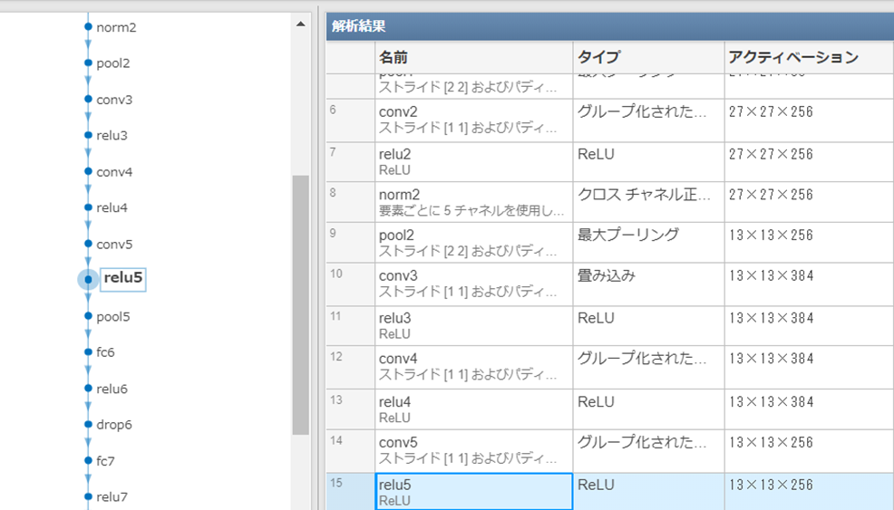

3. 後半の活性化マップを取り出します。論文では、l番目の層と書いてありましたが、最後の畳み込み込み層の結果を設定するのがよいとのことです（3.1.の後半 : the last convolution layer is a more preferable choice)。しかし、その層の演算結果がM×N×Cの形をしていれば、計算自体はどの層でも行えそうです。

4. その活性化マップを入力のサイズまで拡大（上の例ではサイズが13×13で入力が224×224とすると、そのサイズまで拡大する）

5. その活性化マップを取り出し、それぞれのチャンネルを0\textasciitilde{}1になるように正規化する（上の例だと256個あるので256回）

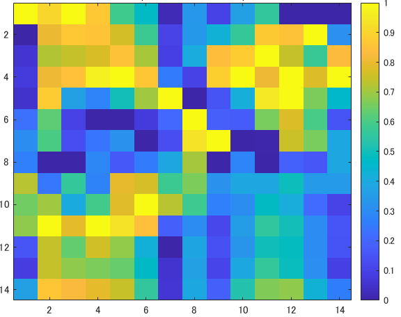

6. 入力画像と上の0\textasciitilde{}1に正規化された画像を掛け合わせ、その画像をCNNで分類し、対象のクラス（例：猫）のスコアを取得する。ここでのスコアとは最後のsoftmax層の後に正規化された値を指します。論文中では以下の記述がありました。

> The relative output value (post softmax) after normalization is more reasonable to measure the relevance than absolute output value (pre-softmax).

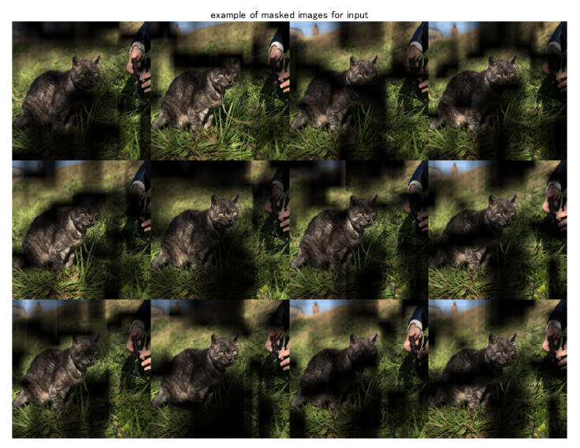

7. 各活性化マップにその時の画像で推論したときのスコアを書けて足し合わせる（以下の補足2のところの図によると、もとの画像で推論したときのスコアを引いたうえでこの計算を行っているようです）

例：上の猫の画像の左上のもので推論をして、猫のスコアが0.8だったとする。また、もとの画像で推論を行ったときの猫のスコアを0.7とする。そのとき、左上のものを生成するのに用いた活性化マップと0.1 (0.8-0.70) を掛け合わせる。この操作をすべてのチャンネル（この例では256）に対して行い、足し合わせる。

8. 7で得たもので0以下の値は0にする

> because we are only interested in the features that have a positive influence on the class of interest

まとめると以下の図のようになります。

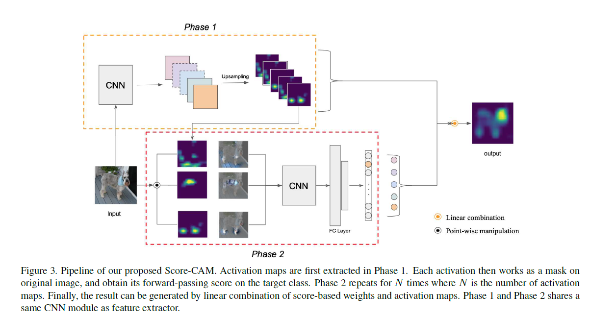

図出典：もとの論文Fig. 3

**参考サイト**

この章は、下の記事ともとの論文を参考にさせていただきました。

[https://qiita.com/futakuchi0117/items/95c518254185ec5ea485\#score-cam%E3%81%A8%E3%81%AF](https://qiita.com/futakuchi0117/items/95c518254185ec5ea485#score-cam%E3%81%A8%E3%81%AF)

# 補足

1 スコアの値をsoftmaxの前とするか後とするか

   -  この論文では、softmax後のスコアを重みとして利用することを述べていました。図5に前と後の値をそれぞれ用いたときの結果を示しています。 

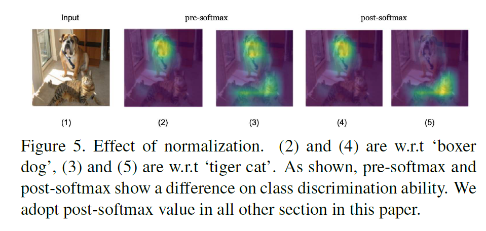

2 アルゴリズムの流れ

`Algorithm 1`にコメントを加えています。

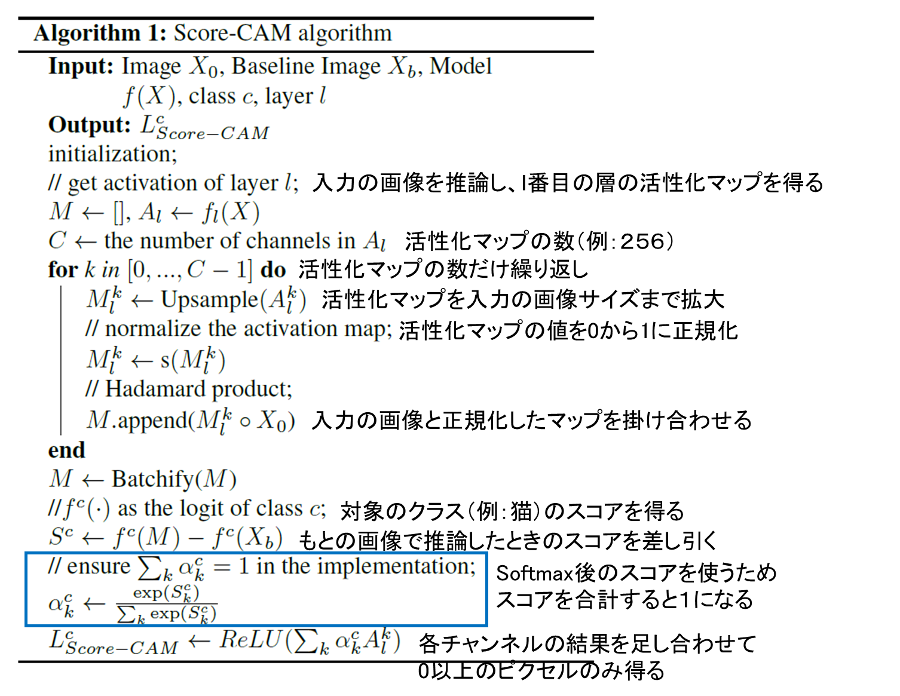

3. Sanity Check

ここでは、ヒートマップの確からしさをSanity Checkとよばれる方法にて確かめています。

以下のようなわかりやすくまとめている記事がありました。

https://yhiss.hatenablog.com/entry/2019/11/24/163218

# 簡単なまとめ

   -  活性化マップを入力画像と掛け合わせ、一部をハイライトした画像を用いて再度推論を行いました 
   -  そのハイライトした画像で推論したときの結果（スコア）をもとに、その活性化マップの重要度を決定しました 
   -  その重要度を掛け合わせ、すべての活性化マップ分だけ足し合わせたものを判断根拠の可視化をした画像として扱いました 

# MATLABでの実装

ここからは、MATLABで実装したときのコードになります。

再度の掲載になりますが、こちらのコードはここにアップロードしています。

https://github.com/KentaItakura/Explainable-AI-interpreting-the-classification-using-score-CAM

## 学習済みネットワークのインポート

CNNで分類するための、学習済みのネットワークをインポートします。本実装のライブスクリプトではプルダウンから`SqueezeNet`, `GoogLeNet`, `ResNet-18`, `MobileNet-v2`が利用可能です。

```matlab:Code
clear;clc;close all
netName = "squeezenet";
net = eval(netName);
```

# 画像サイズと活性化マップを得るための層の名前を抽出

 `activationLayerName` という補助関数がスクリプトの最後に定義されています。この関数によって、それぞれのネットワークに適切な層の名前を指定してくれます。これにより活性化マップを得ることができます

```matlab:Code
inputSize = net.Layers(1).InputSize(1:2);
classes = net.Layers(end).Classes;
layerName = activationLayerName(netName);
```

# 画像の読み込みとリサイズ.

```matlab:Code
im = imread('CatImg.png');
imResized = imresize(im,[inputSize(1:2)]);
```

# CNNで画像を分類

```matlab:Code
[PredCategory,scoreBaseLine]=classify(net,imResized);
PredCategory
```

```text:Output
PredCategory = 
     Norwegian elkhound 

```

CNNで分類された結果のインデックス（番号）を取得します。

```matlab:Code
classIdx=find((net.Layers(end, 1).Classes==PredCategory)==1);
```

# `activation` 関数を用いて活性化マップを得る

```matlab:Code
featureMap = activations(net,imResized,layerName);
MapDim=size(featureMap,3);
idx=randi(MapDim,[1 1]);
figure;imagesc(normalize(featureMap(:,:,idx),'range'));title('example of the feature map');colorbar
```

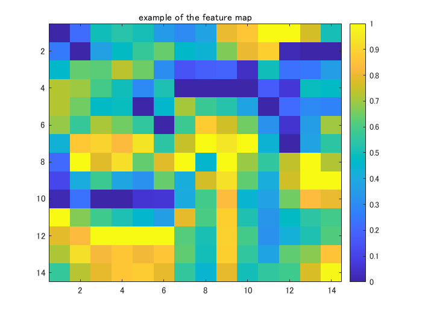

# 入力画像と活性化マップを掛け合わせる

ここでは、以下の計算を行います

   1.  活性化マップのあたいを0から1に正規化する（`normalize`関数） 
   1.  活性化マップを3チャンネルに拡張（同じモノをチャンネル方向に重なる） 
   1.  それぞれのピクセルどうしを掛け合わせる 

```matlab:Code
featureMap_normalized=zeros([inputSize,MapDim]);
for i=1:size(featureMap,3)
    featureMap_resized(:,:,i)=imresize(featureMap(:,:,i),inputSize,'Method',"bilinear");    
    featureMap_normalized(:,:,i) = normalize(featureMap_resized(:,:,i),'range');
    featureMap_layered_i=cat(3,featureMap_normalized(:,:,i),featureMap_normalized(:,:,i),featureMap_normalized(:,:,i)); 
    maskedInputImg(:,:,:,i)=featureMap_layered_i.*double(imResized);
end
```

その例を表示

```matlab:Code
figure;idx=randi(MapDim,[12 1]);
exImg=maskedInputImg(:,:,:,idx);
montage(uint8(exImg));title('example of masked images for input')
```

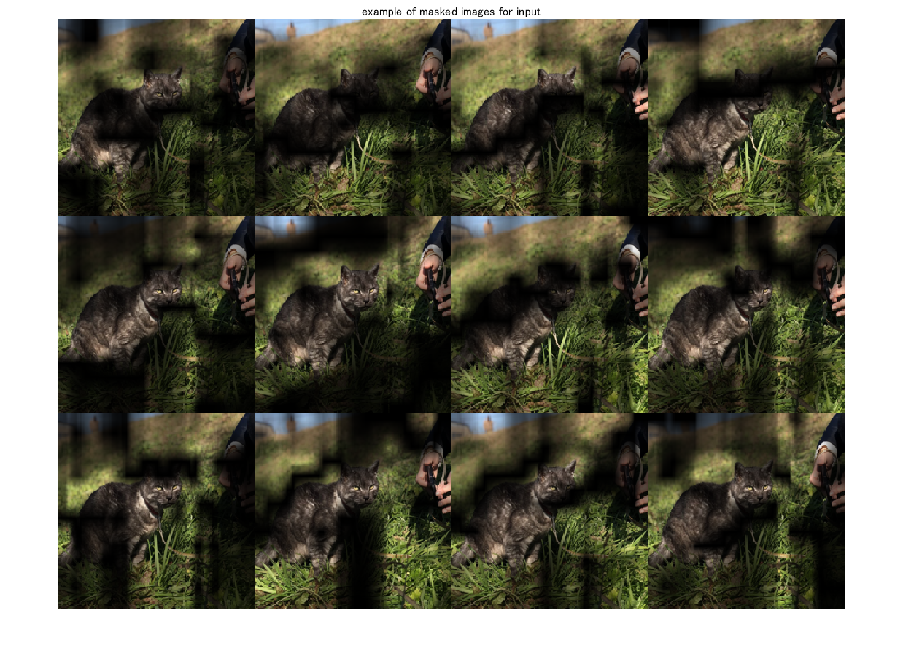

# マスクされた画像にて推論する

`classify`関数を用いて、対象のクラスのスコアを算出する

```matlab:Code
% specify minibatch size. Return an error if the memory is not enough   
% score: (the number of test image)-by-(the number of class (1000))
[PredCategory,score]=classify(net,uint8(maskedInputImg),'MiniBatchSize',32);
score_target_class=score(:,classIdx);
CIC=score_target_class-scoreBaseLine(classIdx);
CIC_norm=softmax(CIC);
```

# 各活性化マップとそのマップで加工した結果で推論したときのスコアを掛け合わせる

```matlab:Code
score_CAM_prep=featureMap_normalized.*reshape(CIC_norm,[1 1 numel(CIC_norm)]);
score_CAM_sum=sum(score_CAM_prep,3);
```

0以下の値を0に丸める（ReLUと同様の操作）

```matlab:Code
score_CAM_sum(score_CAM_sum<0)=0;
```

可視化のために、0から1に正規化する

```matlab:Code
score_CAM_scaled=normalize(score_CAM_sum,'range');
```

可視化のための下準備

```matlab:Code
cmap = jet(255).*linspace(0,1,255)';
score_CAM = ind2rgb(uint8(score_CAM_scaled*255),cmap)*255;
```

入力画像と重ね合わせ

```matlab:Code
combinedImage = double(rgb2gray(imResized))/2 + score_CAM;
combinedImage = normalizeImage(combinedImage)*255;
```

表示

```matlab:Code
figure;imshow(uint8(combinedImage));colorbar;colormap('jet')
```

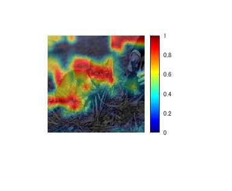

# 補助関数

```matlab:Code
function N = normalizeImage(I)
minimum = min(I(:));
maximum = max(I(:));
N = (I-minimum)/(maximum-minimum);
end
```

# 活性化マップを得るための層の名前を取得する関数

```matlab:Code
function layerName = activationLayerName(netName)

if netName == "squeezenet"
    layerName = 'conv10';
elseif netName == "googlenet"
    layerName = 'inception_5b-output';
elseif netName == "resnet18"
    layerName = 'res5b';
elseif netName == "mobilenetv2"
    layerName = 'Conv_1';
elseif netName == "vgg16"
    layerName = 'conv5_3';
elseif netName == "alexnet"
    layerName = 'conv5';
end

end
```

# 参考文献

[1] Wang, H., Wang, Z., Du, M., Yang, F., Zhang, Z., Ding, S., Mardziel, P. and Hu, X., 2020. Score-CAM: Score-weighted visual explanations for convolutional neural networks. In *Proceedings of the IEEE/CVF conference on computer vision and pattern recognition workshops* (pp. 24-25).

[3] Zhou, B., Khosla, A., Lapedriza, A., Oliva, A. and Torralba, A., 2016. Learning deep features for discriminative localization. In *Proceedings of the IEEE conference on computer vision and pattern recognition* (pp. 2921-2929).
